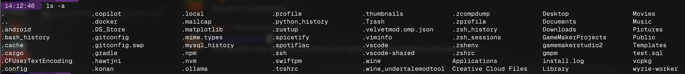
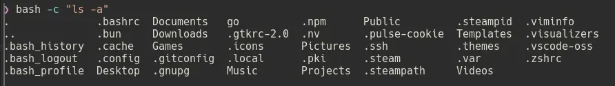
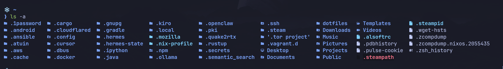
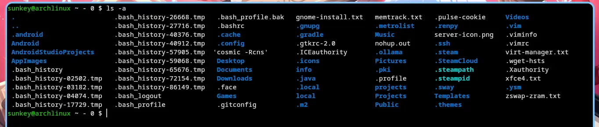

## Hold on, I thought dotfiles were for ricing nerds?!

Yes and no. We'll be talking in terms of Unix and Unix-like environments, sorry, Windows.
Dotfiles refer to any file or directory that starts with a dot.
I won't delve too much into the history of why this came to be, but instead talk of the consequences it brought.
If you're curious about why dotfiles came to be, I recommend watching [Brodie's video on the topic](https://www.youtube.com/watch?v=K_VcmK9PbNU).
If you run the command `ls -a` in your home directory, good chances there is a mess of legacy clutter hanging around unless you go out of your way to make programs follow the [XDG Base Directory Specification](https://specifications.freedesktop.org/basedir/latest/).
For example, here's mine.

```sh
❯ ls -a
./ .cache/ Desktop/ Downloads/ Music/ Projects/ .ssh/ Switch/ Videos/
../ .config/ Documents/ .local/ Pictures/ Public/ .steam/ Templates/ .zshenv
```

## So what's the issue?

The issue is clutter.
We have specifications in the form of the XDG Base Directory for applications to put their files into.
Yet you are guaranteed to see `.pki .bashrc .steam`, and a lot more in your home directory.
Here are some examples of what a cluttered home directory looks like with dotfiles.






There are specifications for programs on where they should place their files, and most of the time, it's unused.
Some of the reasons for this are because of legacy backwards compatibility.
If suddenly, your Bash config moved, and it had some important environmental variables, your entire system could fail, and you'd have no idea why, unless you read Bash changelogs.
The best approach I've found to the issue, is to check if the directory or file already exists.
As an example, here's what Chromium does to the `~/.pki` directory.
If `~/.pki` already exists, keep using it.
But, if a `~/.pki` doesn't exist, create a new in `$XDG_DATA_HOME` and use that instead of the legacy location.
If you have used any Electron app pre-version 41, you might have noticed a `~/.pki` folder.
[An issue was reported on Jan 1, 2020](https://issues.chromium.org/issues/40666379) to move the path to a more reasonable location, and took until Feb 9th, 2026 to have it merged.
I understand that maintainers don't have a lot of free time, handling hundreds of issues at a time.
But, 6 years is quite a long time, and goes to highlight the issue of why even bother?
If the path works and has no real issues, why should I, as a maintainer, change what could be hundreds of hardcoded paths, and what if another completely unrelated app expects the file to be at the old location?

## If it ain't broke, don't fix it

I feel that the core issue is that developers aren't incentivized to follow the specification.
You can introduce a breaking change to move the location of files that might break some systems, have two places for configuration, data, or state files to go, or some other arbitrary solution.
There is no good clean solution without making breaking changes.
Sticking with the way you've always done things is the least messy way of going about it, I mean, the users don't really care where their program files are as long as it works.
There are efforts like [XDG Ninja](https://github.com/b3nj5m1n/xdg-ninja) to check your home for unwanted files and directories.
It is possible to have a home directory with no dotfiles, but, it's extremely convoluted and tricky.
Most apps just hardcode the directory into your home and don't allow for changes.

## Finishing thoughts

While placing dotfiles in your home directory doesn't actually cause real harm, some people find it quite annoying (I am included in this).
Just take a look at the [Arch Wiki page](https://wiki.archlinux.org/title/XDG_Base_Directory).
Many programs do and don't follow the specification.
All in all, it's one giant mess of specifications that's troubling for developers to implement, and users to force programs to implement.
